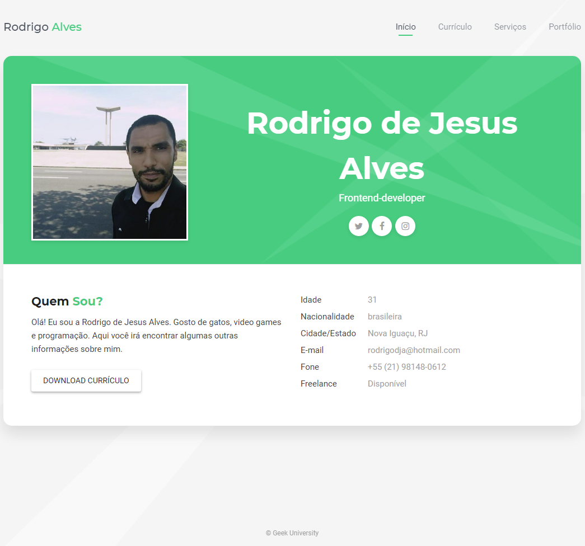

# Nome do seu projeto
> Um resumo curto sobre o que seu projeto faz

Um ou dois paragrafo sobre o seu projeto sobre o 
que seu projeto faz.



## Intalação

Mac OS x Linux:

```sh
npm intall --save
```

Windows:

```sh
edit autoexec.bat
```

## Exemplo de uso

Alguns exemplos que motivariam as pessoas a utilizarem seu projeto ou que demonstrasse que este é útil para alguma coisa. Divida esta parte em partes menores e se possível coloque algum código ou prints de tela.

## Ambiente de Desvolvimento

Descrever como instalar e preparar qualquer dependência de desenvolvimento para que seu projeto possa ser executado localmente e pessoas possam contribuir com o mesmo. Se possível forneça as informações para diferentes plataformas, exemplo Windows, Linux e Mac OS.

## Histórico de Atualizações

* 0.2.1
  *  CHARGE: Atualização dos docs (o código não foi alterado)
* 0.2.0
  * CHARGE: Removida a função `setPadãoXYZ()`
  * ADD: Adicionado a função `inicializar ()`
* 0.1.1
  * FIX: Crash quando executava `escrever()` (Obrigado ao @Contribuidor)
 * 0.1.0
    * O primeiro lancamento estavel
    * CHARGE: Renomeado de `Projeto XYZ` para `Projeto ABC`
* 0.0.1
    * Projeto inicial

## Meta

Seu nome - [@SeuTwitter](https://twitter.com/seuTwitter) - seuemail@gmail.com

Distribuido sobre a licença. Veja `LICENÇA` para mais informações.

[https://github.com/seuusuario/seuprojeto](https://github.hub/seuusuario)
